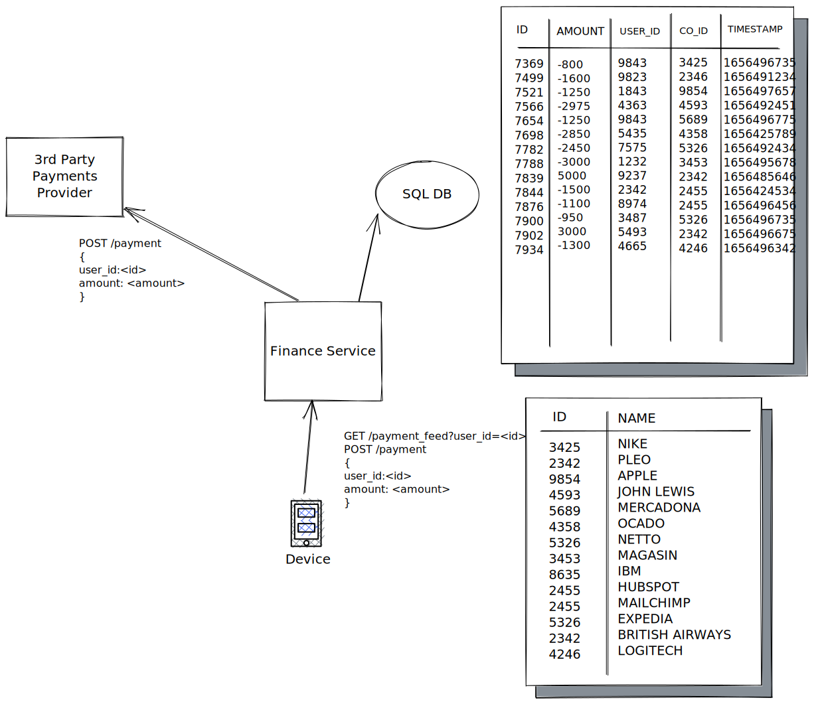

# Take a home challenge

## Introduction

Pleo uses a microservice architecture, in which the whole system architecture is divided into smaller systems to provide granular functionality. One of these subsystems is the “Finance Service” whose business goal is to provide wallet information and be able to make payments. Currently, this service exposes a REST interface with two endpoints:

- Fetch payments feed with the wallet balance from the user. Each payment describes the amount paid and to which provider
- Create a new payment

As you can see there is only one instance of the “Finance Service” running, which is exposed directly to the internet. On the storage layer, there is an SQL-like database that contains two tables. One table tracks the wallet payments and the other contains provider information.



([source](https://excalidraw.com/#json=YcUhmaK-Wvvf65YXUWmGQ,Sy_wMyZIZlFZjSf2ocImAQ))

### Payment feed response example

```jsx
{
	"user_id": 3456,
	"balance": 2000,
	"transactions" : [
		{
			"id": 7844,
			"name": "Pleo",
			"amount": 5000,
			"timestamp": 1656477038
		},
		{
			"id": 7855,
			"name": "Apple",
			"amount": -3000,
			"timestamp": 1656487348
		}
	]
}
```

## Tasks

You have been tasked to scale Pleo from a tiny service with a few users to a system that should be able to serve thousands of customers concurrently. 

The goal of this challenge is to describe **what changes would you do to the system to support exponential growth** and **how will you make sure the system works as expected with those changes**. The task is intentionally vague but there are some things to have in mind:

- This service deals with money and it should be as reliable as possible
- We don’t have control over the scalability of the 3rd party system but we can suggest improvements or changes in the API. The external service does not offer any staging or sandbox environment.
- We would like to scale to be able to support millions of stored users and in the range of ~10000 peak concurrent users. The external payment processor has a limit in the hundreds of payments per second.
- You can assume that the volume of *write* operations (process a payment) will always be lower than the volume of *read* operations (checking balance)

## How to submit the solution

You can share it in a document based on the [Pleo Design Doc template](Template-Design-Doc.md) or in the format of your choice. 

We recommend you to follow an iterative approach, and on each scaling phase, describe the steps taken to scale the system, how to load test it, what assumptions were taken, and a link or an image to a design tool that describes the solution. Each of these steps can be a new commit so we can see the design process.
